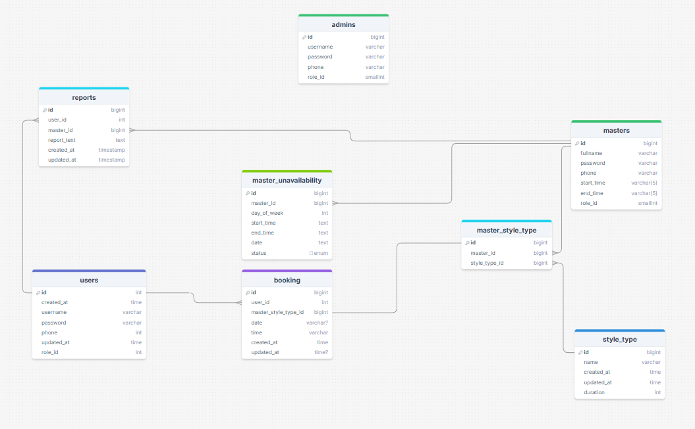

# 💇 ChairTime — Fullstack Hair Salon Booking App

ChairTime is a fullstack web application that allows customers to browse hairstyles, book appointments, and manage their profiles while salon owners can manage schedules, services, and clients.

---

## 🚀 Features

- **Customer Portal**
  - Book, reschedule, or cancel appointments
  - Manage personal profile  

- **Salon Admin Portal**
  - Manage staff schedules
  - Add/edit hairstyles & services
  - View customer bookings  

- **General**
  - User authentication (JWT)
  - Role-based access (Customer / Admin)
  - Responsive UI (desktop + mobile)
  - REST API backend with migrations

---

## 🛠 Tech Stack

### Frontend
- React + TailwindCSS  
- React Router  
- Axios (API requests)  

### Backend
- Go (Golang)  
- Echo (HTTP framework)  
- PostgreSQL (database)  
- Migrations with `golang-migrate`  
- JWT authentication  

### Tools
- Swagger / OpenAPI for API docs  

---

## 🗄️ Database Design

The following diagram shows the main entities and relationships in the ChairTime app:

